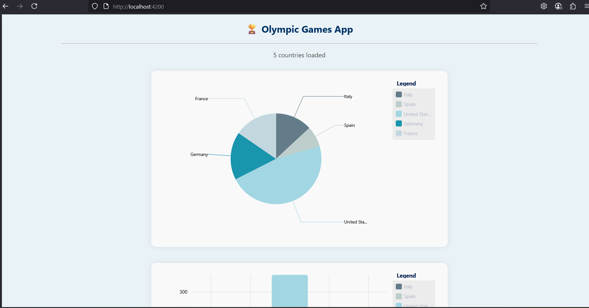
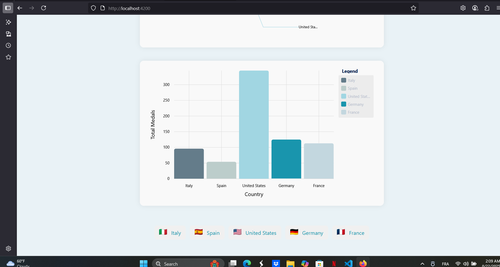
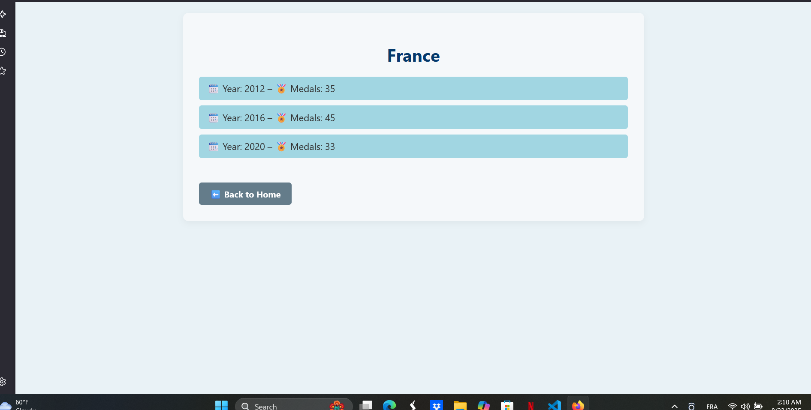
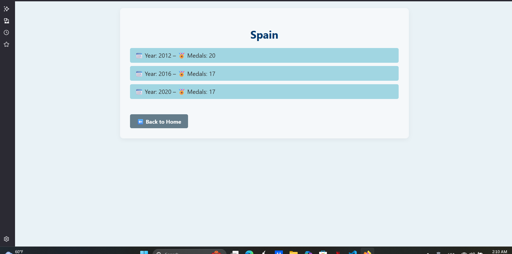
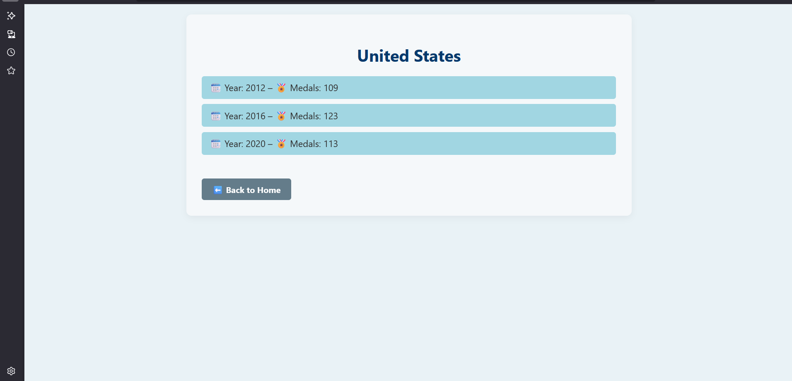

# 🏅 Olympic Medals Dashboard

A simple and interactive web app that visualizes Olympic data using Angular and ngx-charts.  
This project was built as part of a learning journey with Studi.

---

##  How to Run the App

1. **Clone this repo:**
   ```bash
   git clone https://github.com/eman-java-dev/olympic-medals2-app
   ```

2. **Navigate into the project folder:**
   ```bash
   cd olympic-medals2-app
   ```

3. **Install all dependencies:**
   ```bash
   npm install
   ```

4. **Start the development server:**
   ```bash
   ng serve
   ```

5. **Open your browser and visit:**
   ```arduino
   http://localhost:4200
   ```

---

##  What I Learned

- Using Angular services with observables and subjects  
- Routing with dynamic parameters (`/country/:id`)  
- Styling components with SCSS  
- Loading and mapping local JSON data  
- Adding and customizing charts using ngx-charts  
- Better error handling in Angular apps

---

##  Folder Structure Overview

```
src/
├── app/
│   ├── core/
│   │   ├── models/          # Olympic model (interface)
│   │   └── services/        # OlympicService for fetching data
│   ├── pages/
│   │   ├── home/            
│   │   └── not-found/       # 404 page (optional)
│   └── components/
│       └── country-detail/  # Detail view for a selected country
├── assets/
│   └── mock/
│       └── olympic.json     # Mock data file
```

---

##  Sources & Credits

- Mock data adapted from the OpenClassrooms platform  
- Flag icons provided by [flagcdn.com](https://flagcdn.com)  
- Built with  using [Angular](https://angular.io)
- Charts powered by [ngx-charts](https://swimlane.github.io/ngx-charts/)

---

## ✅ Status

✅ All required features implemented  
✅ Charts work as expected  
✅ Error handling added  
✅ Dynamic routing implemented  
✅ Code is cleaned, commented, and organized  
✅ Ready to be presented or submitted 

---
## Screenshots

### 🏠 Home Page



### 📄 Country Detail Page





### ❌ Error Message Example


---

> If you're learning Angular or building a dashboard like this, feel free to fork😊 the repo and experiment with it. I had a great time working on it and learned a lot in the process! 😊
