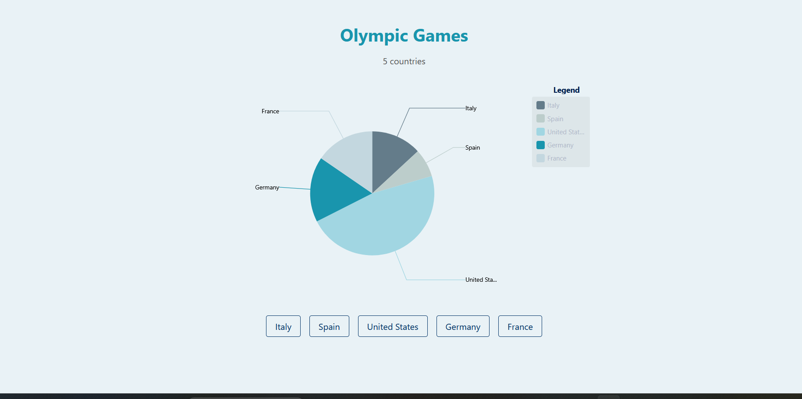
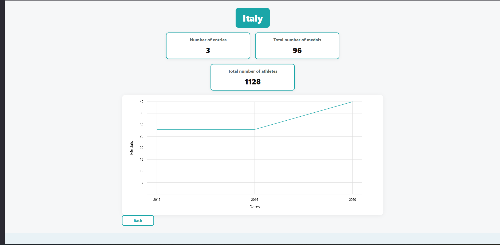
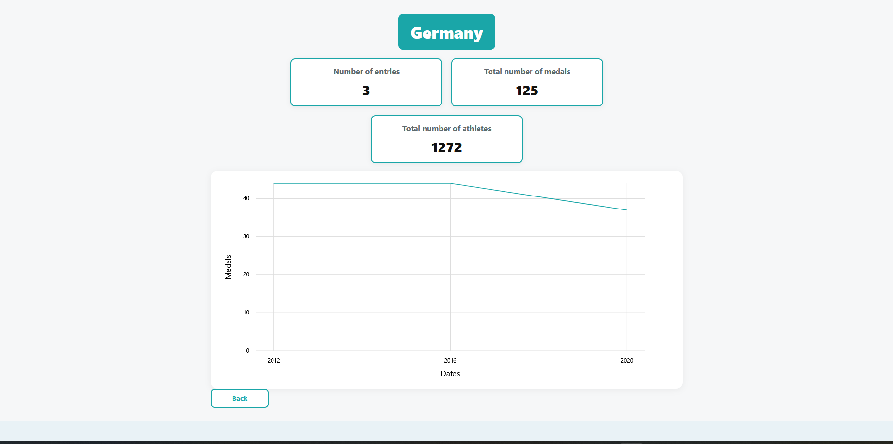
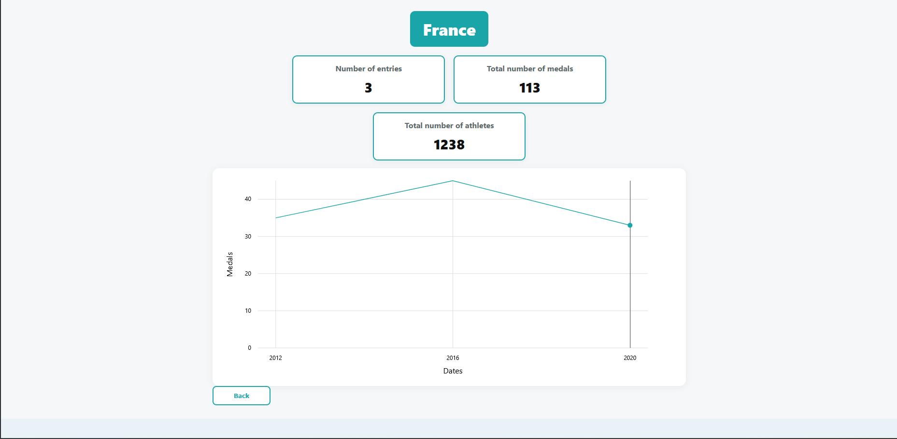
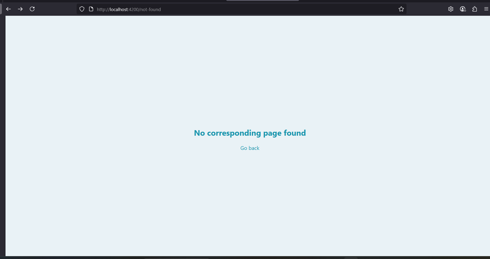

#  Olympic Medals Dashboard
 An interactive Angular web application that visualizes Olympic Games data using charts. This project was developed as part of the  OpenClassrooms learning path.

The goal of this application is to display Olympic medal statistics by country in a clear and visual way, using Angular best practices, routing, services, and chart libraries.

---

##  How to Run the App

1. Clone the repository:
git clone https://github.com/eman-java-dev/olympic-medals2-app

2. Navigate to the project folder:
cd olympic-medals2-app

3. Install all dependencies:
npm install

4. Run the development server:
ng serve

5. Open the application in your browser:
http://localhost:4200

---

##  Project Goals

The main objectives of this project are:
- Display Olympic medal data by country
- Visualize data using charts (pie chart on the home page and line chart on the country detail page)
- Navigate between pages using Angular routing with dynamic parameters
- Structure the project using Angular best practices (pages, components, core, services, models)
- Handle loading and error states properly
- Provide a responsive user interface for desktop, tablet, and mobile devices

---

---

##  What I Learned

During this project, I learned and practiced:
- Using Angular services with HttpClient
- Managing data with Observables and Subjects
- Subscribing to data streams and sharing state across components
- Routing with dynamic parameters such as /country/:id
- Structuring an Angular project in a clean and scalable way
- Loading and mapping local JSON mock data
- Creating interactive charts using ngx-charts
- Basic responsive testing using browser DevTools
- Improving code readability and maintainability

---
## 📁 Project Structure
src/
└── app/
    ├── components/
    │   └── country-detail/
    │       ├── country-detail.component.html
    │       ├── country-detail.component.scss
    │       └── country-detail.component.ts
    │
    ├── core/
    │   ├── models/
    │   │   ├── Olympic.ts
    │   │   └── Participation.ts
    │   │
    │   ├── charts.ts
    │   └── services/
    │       └── olympic.service.ts
    │
    ├── pages/
    │   └── home/
    │       ├── home.component.html
    │       ├── home.component.scss
    │       ├── home.component.ts
    │       └── home.component.spec.ts
    │
    ├── not-found/
    │   ├── not-found.component.html
    │   ├── not-found.component.scss
    │   └── not-found.component.ts
    │
    ├── app-routing.module.ts
    ├── app.component.ts
    └── app.module.ts
    │
└── assets/
    └── mock/
        └── olympic.json

screenshots/

---
---

##  Data Source

The application uses a local JSON file as a mock data source located at:
src/assets/mock/olympic.json

This file simulates data that would normally come from a backend API in a real-world application.

---

##  Responsive Design

The application has been tested using browser DevTools in responsive mode. It works on:
- Desktop screens
- Tablet screens
- Mobile screens (for example iPhone 11 or iPhone 12)

The layout and charts adapt to different screen sizes.

---

##  Sources & Credits

- Mock data adapted from the OpenClassrooms platform  
- Flag icons provided by [flagcdn.com](https://flagcdn.com)  
- Built with  using [Angular](https://angular.io)
- Charts powered by [ngx-charts](https://swimlane.github.io/ngx-charts/)

---

##  Project Status

All required features have been implemented.
Charts display correct data.
Dynamic routing is functional.
Error handling is implemented.
The codebase is clean, organized, and ready for evaluation.

---
## 📸 Application Screenshots

### 🏠 Home Page

---

### 🇮🇹 Country Detail – Italy

---

### 🇪🇸 Country Detail – Spain

---

### 🇩🇪 Country Detail – Germany

---

### 🇫🇷 Country Detail – France

---

### 🇺🇸 Country Detail – United States

---

### ❌ Error Message Example

---

> This project helped me strengthen my understanding of Angular fundamentals, data visualization, and application structure. It represents an important step in my learning journey.
